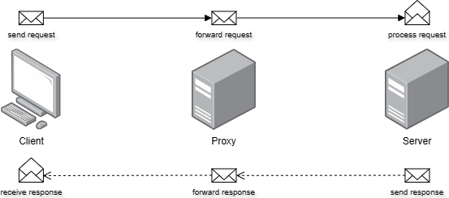
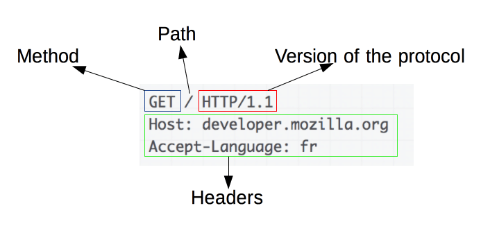
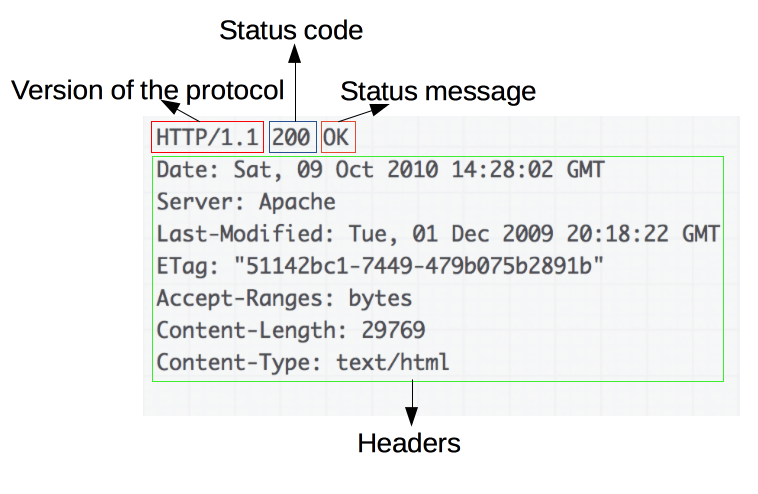

# RESTful APIs

## The HTTP protocol

### What is HTTP?

The HyperText Transfer Protocol (HTTP) defines the set of rules for client-server communication on the web. It's the primary protocol for data transmission across the internet.

### Components of an HTTP system

- Client
- Request
- Proxy
- Server
- Response

### Request format

### Response format

### References

- <https://developer.mozilla.org/en-US/docs/Web/HTTP/Overview>
- <https://aws.amazon.com/compare/the-difference-between-https-and-http/>
- <https://www.nginx.com/resources/glossary/http/>
- <https://blog.postman.com/what-is-http/>

### Other Sections

- Prev: [What is a REST API?](./01%20RESTful%20APIs%20-%2001%20What%20is%20a%20REST%20API.md)
- Next: [Web Resources](./01%20RESTful%20APIs%20-%2003%20Web%20Resources.md)
