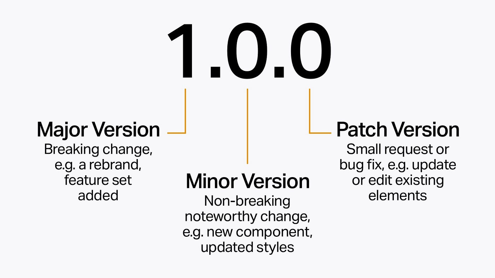

# RESTful APIs

## Versioning

### What is API versioning?

It's the process of managing and tracking changes to an API. It's important that these changes are communicated to the API's consumers.

### Semantic versioning

Semantic versioning (or Semver) is the most common versioning strategy implemented by libraries, apps, and frameworks.

Given a version number `{major}.{minor}.{patch}`, increment the:

- `major` version when you add breaking changes
- `minor` version when you add backwards compatible features
- `patch` version when you add backwards compatible fixes



### Types of API versioning

#### URI versioning

```text
https://api.example.com/v1/resources

https://api.example.com/v2/resources

https://api.example.com/v3/resources
```

#### Query Param versioning

```text
https://api.example.com/resources?version=v1

https://api.example.com/resources?version=v2

https://api.example.com/resources?version=v3
```

#### Header versioning

```text
https://api.example.com/resources
Version: v1

https://api.example.com/resources
Version: v2

https://api.example.com/resources
Version: v3
```

### References

- <https://www.postman.com/api-platform/api-versioning/>
- <https://semver.org/>
- <https://www.pluralsight.com/resources/blog/guides/introduction-to-semantic-versioning>

### Other Sections

- Prev: [Status Codes](./01%20RESTful%20APIs%20-%2004%20Status%20Codes.md)
